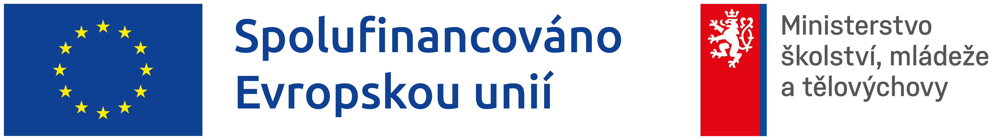

<link rel="stylesheet" href="assets/style.css">

# MyGRACE – Otevřená věda

Projekt **Migrace a my: Mobilita, uprchlictví a hranice v perspektivě humanitních věd (MyGRACE)** podporuje otevřenou vědu, transparentní sdílení výsledků a odpovědnou správu výzkumných dat.  
Tento web slouží jako přehled povinností, doporučení a praktických kroků, které musí řešitelé projektu dodržet.

---

## 🔗 Rychlý rozcestník

### [📚 Otevřený přístup k publikacím](01-open-access.md)

### [📊 Správa výzkumných dat](02-research-data.md)

### [💾 Uložení dat do repozitáře](03-ulozeni-dat.md)

### [❓ Nejčastější otázky (FAQ)](04-faq.md)

---

## 👥 Pro koho je web určen

Tento web je určen členům týmu projektu **MyGRACE**, výzkumníkům a administrátorům, kteří potřebují splnit povinnosti otevřené vědy a hledají praktické návody, jak na to.

---

## 📬 Kontakty

Máte dotazy k otevřenému přístupu k publikacím? Primárně kontaktujte Vaši institucionální podporu Open Science.

[Ostravská univerzita](https://www.osu.cz/open-science/kontakty/)

[Ústavy AV ČR](https://openscience.lib.cas.cz/contacts/)

Máte dotazy ke správě výzkumných dat? V rámci projektu MyGRACE se můžete obrátit na **Data Stewardku projektu**, která poskytuje metodickou podporu, konzultace a pomoc s praktickými kroky.

**E‑mail:** zemanova@ucl.cas.cz (Veronika Zemanová, Ústav pro českou literaturu AV ČR)

---

*Toto dílo vzniklo v rámci projektu Migrace a my: Mobilita, uprchlictví a hranice v perspektivě humanitních věd, reg. č. CZ.02.01.01/00/23_025/0008741, řešeného v Ústavu pro českou literaturu AV ČR v.v.i. a spolufinancovaného Evropskou unií.*

[MyGRACE – Otevřená věda](ccccc) © Veronika Zemanová, 2026. Dílo je licencováno pod [CC BY 4.0](https://creativecommons.org/licenses/by/4.0/deed.cs).

---

*Poslední aktualizace: {{ site.time }}*
